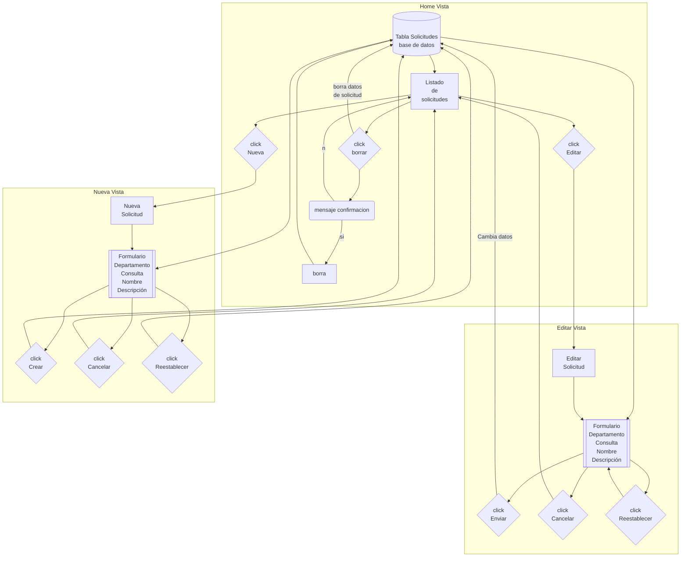
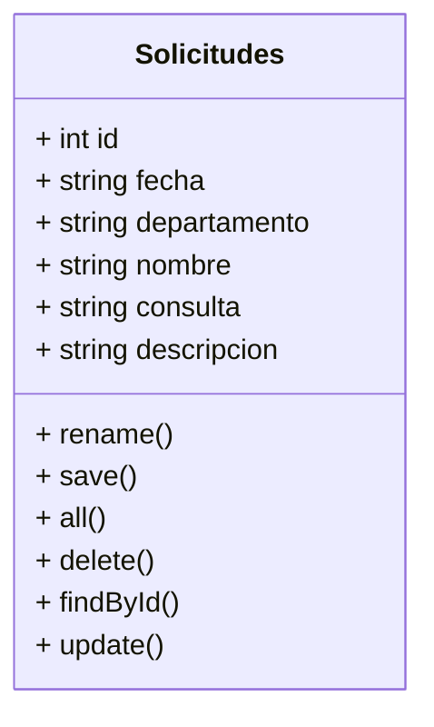

Mibile version

## Required

- PHP 7.4 min

## Install

- composer install (or composer update)

## 🛠️ Herramientas usadas en este proyecto

| Front End | Back End | Diseño y organización | 
| :---: | :---: | :---: |
|      |    |      |

## ✒️ Autoras 

| Nombre | Roll |  |
| ---: | :---: | :---: |
| Cristina | Web Developer| https://github.com/CSanchezCadrecha |
| Marina | Web Developer| https://github.com/Yelose |
| Sara | Web Developer | https://github.com/Sarap120298 |
| Esther | Scrum Master | https://github.com/Estherherrera |
| Marybell | Product Owner | https://github.com/MBellJDD |

## Diagrama de Flujo

Ver diagrama

  

    
    

## Diagrama UML

