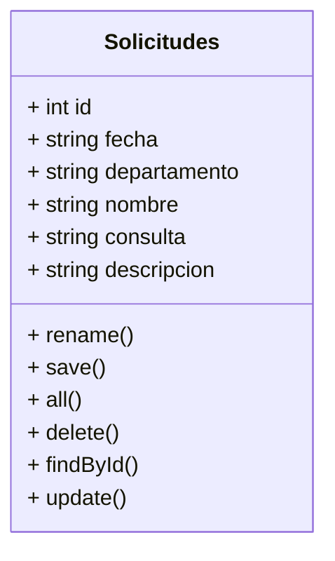

## Required

- PHP 7.4 min

## Install

- composer install and/or composer update

## 🛠️ Herramientas usadas en este proyecto

| Herramientas |
| :---: |
|  |
<ul>
  <li>Visual Studio Code</li>
  <li>Figma</li>
  <li>GoogleDocs</li>
  <li>GoogleFonts</li>
  <li>Zoom</li>
  <li>Bootstrap</li>
  <li>PDO</li>
  <li>SQL</li>
  <li>PHPMyAdmin</li>
</ul>

## ✒️ Autoras 

| Nombre | Roll | Github |
| :---: | :--- | :---
| Cristina | Web Developer| https://github.com/CSanchezCadrecha |
| Marina | Web Developer| https://github.com/Yelose |
| Sara | Web Developer | https://github.com/Sarap120298 |
| Esther | Scrum Master | https://github.com/Estherherrera |
| Marybell | Product Owner | https://github.com/MBellJDD |

## Diagrama UML

