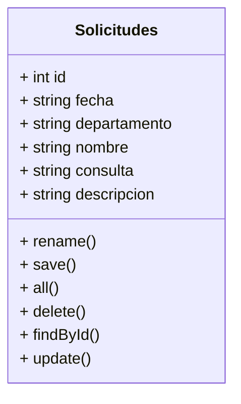

Mibile version

## Required

- PHP 7.4 min

## Install

- composer install (or composer update)

## 🛠️ Herramientas usadas en este proyecto
<<<<<<< HEAD
<ul>
  <li>Visual Studio Code</li>
  <li>Figma</li>
  <li>GoogleFonts</li>
  <li>Bootstrap</li>
  <li>PDO</li>
  <li>MySQL</li>
  <li>PHPMyAdmin</li>
</ul>

## ✒️ Autoras 
<ul>
  <li>Cristina (web developer)</li>
  <li>Marina (web developer)</li>
  <li>Sara (web developer)</li>
  <li>Esther (Scrum Master)</li>
  <li>Marybell (Product Owner)</li>
</ul>

## User Flow

=======

| Front End | Back End | Diseño y organización | 
| :---: | :---: | :---: |
|      |    |     |

## ✒️ Autoras 

| Nombre | Roll |  |
| ---: | :---: | :---: |
| Cristina | Web Developer| https://github.com/CSanchezCadrecha |
| Marina | Web Developer| https://github.com/Yelose |
| Sara | Web Developer | https://github.com/Sarap120298 |
| Esther | Scrum Master | https://github.com/Estherherrera |
| Marybell | Product Owner | https://github.com/MBellJDD |

>>>>>>> ebe3de98fbc539836b865f43a896fc4e5cae7564
## Diagrama UML

